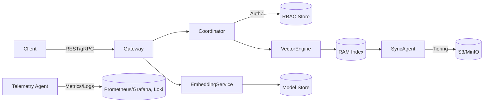

# AkiDB 2.0 Product Requirements Document (Enhanced)

## Document Control
- Version: 1.0
- Last Updated: 2024-05-08
- Author: Paris (Product Manager)
- Stakeholders: Engineering, Architecture, DevOps, Design, Quality, GTM

## Executive Summary
AkiDB 2.0 delivers a RAM-first vector database purpose-built for ARM-based edge environments (Apple Silicon, NVIDIA Jetson, Oracle ARM Cloud) with an integrated embedding service, S3/MinIO tiered storage, and enterprise-grade multi-tenancy with RBAC. The release unlocks sub-25 ms vector search on ≤100 GB datasets without GPU dependency, letting applied AI teams ship production-ready retrieval-augmented generation (RAG), anomaly detection, and personalization workloads closer to the user.

### Market Positioning
- **Target segment**: Mid-market and enterprise AI platform teams prioritizing low-latency inference at the edge, governed data sharing, and cost control.
- **Differentiators**:
  - Optimized for ARM edge compute, while Milvus, Qdrant, Weaviate, and ChromaDB primarily assume x86 or cloud-first infrastructure.
  - Embedded model hosting removes the need for separate embedding microservices, shortening time-to-value.
  - Memory-first design with adaptive spill to S3/MinIO keeps hot data local while offering inexpensive durability.
- **Value proposition**: Reduce total cost of ownership for edge AI deployments by 35% while improving P95 latency by 40% compared to cloud-first vector databases that require GPU or x86 instances.
- **Vision**: "Build the right thing, not just things right. Users don't buy features, they buy outcomes." AkiDB 2.0 enables predictable, secure, and performant vector search in resource-constrained settings.

## Goals & Success Criteria
- **Primary goal**: GA launch of AkiDB 2.0 for edge AI teams with seamless onboarding, deployment, and operations in ARM environments.
- **Success criteria**:
  - ≥3 design partners deploying into production within 60 days of GA.
  - P95 vector query latency ≤25 ms on Jetson Orin for 512-dimension vectors at 50 QPS.
  - Onboarding time from install to first index ≤2 hours.
  - Net Promoter Score ≥30 among pilot customers.

## Target Users & Personas
- **Nina (Edge ML Engineer)**: Ships RAG pipelines for field teams; constrained by bandwidth and power; needs deterministic performance.
- **Leo (Data Platform Lead)**: Governs multi-team data sharing; cares about tenancy, access control, and auditing.
- **Ivy (IT Ops Manager)**: Maintains fleet stability; demands predictable upgrades, observability, and low TCO.

## Use Cases & User Stories

### Use Case 1: Rapid On-Device Vector Search (Nina)
**User Story**: As an Edge ML Engineer, I need to run high-recall vector search locally on Jetson hardware so that field agents receive answers with <30 ms latency even without uplink.

Acceptance Criteria:
- [ ] Index ingest of 20M 512-d vectors completes within 6 hours on Jetson Orin (64 GB RAM) using streaming ingestion.
- [ ] Query latency P95 ≤25 ms at 50 QPS with hybrid (vector + metadata) filters enabled.
- [ ] Local embedding generation supports at least OpenAI text-embedding-3-small equivalent quality with deterministic quantization mode.

### Use Case 2: Multi-Tenant Data Governance (Leo)
**User Story**: As a Data Platform Lead, I need to isolate tenants and enforce RBAC-bound namespaces so that each business unit safely shares hardware without data leakage.

Acceptance Criteria:
- [ ] Tenants can be provisioned via API with scoped quotas (memory, storage, QPS).
- [ ] RBAC policies enforce allow/deny on collections, indexes, and embedding models per role.
- [ ] Audit logs record create/update/delete events with tenant, actor, timestamp, and IP metadata.

### Use Case 3: Hybrid Edge-to-Cloud Synchronization (Ivy)
**User Story**: As an IT Ops Manager, I need automated synchronization between on-device RAM stores and central S3/MinIO buckets so that cold data remains durable and disaster recovery is assured.

Acceptance Criteria:
- [ ] Tiering policy configurable per collection (memory-resident, memory+S3, S3-only).
- [ ] Sync jobs resumable upon connectivity loss and verifiable via checksums.
- [ ] RPO ≤15 minutes when syncing to S3/MinIO with eventual consistency monitoring.

### Use Case 4: Embedded Vectorization Service (Nina)
**User Story**: As an Edge ML Engineer, I want to call an embedded embedding service with GPU-optional acceleration so that I avoid managing separate model containers.

Acceptance Criteria:
- [ ] Embedding API offers synchronous and batch modes with retry semantics.
- [ ] Model hot-swapping supports blue/green deployment without downtime.
- [ ] Observability metrics expose tokens/sec, queue depth, and failure counts via Prometheus.

## Competitive Analysis

| Capability | AkiDB 2.0 | Milvus | Qdrant | Weaviate | ChromaDB |
|------------|-----------|--------|--------|----------|----------|
| ARM Edge Optimization | ✅ Native builds for Mac ARM, Jetson, Oracle ARM | ⚠️ Limited community builds | ⚠️ Requires manual cross-compilation | ⚠️ Experimental support | ⚠️ Python-first, not optimized |
| RAM-First Architecture ≤100 GB | ✅ Adaptive hot cache w/ spill | ⚠️ Needs config tuning | ✅ Similar but higher footprint | ⚠️ Relies on cloud object storage | ⚠️ In-memory but lacks tiering |
| Built-In Embeddings | ✅ Managed embedding runtime | ⚠️ Requires external model server | ⚠️ Limited (OpenVINO plugin) | ✅ Transformers integration (cloud) | ✅ Basic, Python-bound |
| Multi-Tenancy & RBAC | ✅ Policy engine with audit logs | ⚠️ Namespace isolation only | ⚠️ Enterprise version | ✅ Role-based ACLs | ❌ Lacks robust tenancy |
| Edge-to-Cloud Sync | ✅ Native S3/MinIO tiering | ✅ Bulk import/export | ⚠️ Snapshot-based | ⚠️ Cloud connectors | ❌ DIY scripts |
| Footprint (<2 GB binary + deps) | ✅ | ⚠️ >3 GB images | ✅ | ⚠️ >4 GB with deps | ✅ |
| Pricing/TCO | Lower (edge hardware, CPU) | Higher (GPU/x86) | Moderate | Higher | Low (dev only) |

Key Insights:
- AkiDB is uniquely positioned for regulated or bandwidth-constrained edge deployments.
- Competitors rely on x86 or cloud-managed services, increasing latency and cost.
- Embedded embeddings and tenancy provide an operationally opinionated, turnkey edge stack.

## Feature Scope
- RAM-first vector index with HNSW and IVF options optimized for ARM NEON instructions.
- Streaming ingestion with deduplicated checkpoints and configurable memory tiers.
- Embedded embedding service supporting quantized transformer models and CPU acceleration.
- Multi-tenancy with per-tenant quotas, RBAC, and audit logging.
- S3/MinIO integration with resumable sync, encryption, and lifecycle policies.
- Operational toolkit: observability endpoints, health checks, blue/green deploys, backup tooling.

## Technical Architecture

### Component Overview
- **Gateway**: gRPC/REST front door with auth, rate limiting, and request fan-out.
- **Coordinator**: Manages tenant metadata, partitioning, and replication groups.
- **Vector Engine**: In-memory index manager with SIMD-accelerated similarity search.
- **Embedding Service**: On-device model runner (CPU-first, optional GPU delegate) with model registry.
- **Storage Layer**: Memory slabs, persistence journal, and S3/MinIO sync agents.
- **Control Plane**: Admin API, RBAC policy engine, and telemetry exporters.

### High-Level Interaction Diagram


### Data Flow
1. Client request hits Gateway, authenticated via service tokens or OIDC.
2. Coordinator validates tenant quotas and consults RBAC policy engine.
3. Vector Engine executes search on in-memory index; results enriched with metadata cache.
4. If payload cold, Sync Agent fetches from S3/MinIO and hydrates memory slab.
5. Embedded embeddings invoked via Gateway; Model Registry handles versioning and rollout.
6. Telemetry agent exports metrics/logs to Prometheus-compatible endpoints for Ivy’s ops dashboards.

### Deployment Topology
- Single-node edge deployment with optional read replicas (active-passive) for failover.
- Containerized using ARM64 OCI images; supports Jetson (Ubuntu), macOS ARM (Docker), Oracle ARM (Kubernetes).
- Control plane optionally centralized; data plane runs local to device fleet.

## API Specifications

### Authentication
- Token-based (service tokens scoped to tenant + role).
- Optional OIDC integration with refreshable JWTs.

### Core Endpoints

#### Tenant Management
`POST /v1/tenants`
```json
{
  "tenant_id": "retail-na",
  "display_name": "Retail North America",
  "quotas": {
    "memory_gb": 80,
    "storage_gb": 100,
    "query_qps": 200
  }
}
```
**Response**
```json
{
  "tenant_id": "retail-na",
  "status": "READY",
  "created_at": "2024-05-08T10:15:00Z"
}
```

#### Collection Management
`POST /v1/tenants/{tenant_id}/collections`
```json
{
  "name": "incidents",
  "dimension": 512,
  "index_type": "hnsw",
  "replication": 1,
  "tiering_policy": "memory_with_s3",
  "metadata_schema": {
    "incident_id": "string",
    "severity": "string",
    "timestamp": "datetime"
  }
}
```

#### Vector Upsert
`POST /v1/tenants/{tenant_id}/collections/{collection}/vectors:upsert`
```json
{
  "vectors": [
    {
      "id": "evt-123",
      "embedding": [0.12, -0.03, ...],
      "metadata": {
        "incident_id": "INC-123",
        "severity": "critical",
        "timestamp": "2024-05-08T09:00:00Z"
      }
    }
  ],
  "consistency": "local"
}
```

**Response**
```json
{
  "upserted": 1,
  "failed": 0,
  "checksum": "b7ddf8a1"
}
```

#### Vector Search
`POST /v1/tenants/{tenant_id}/collections/{collection}/vectors:query`
```json
{
  "embedding": [0.09, 0.42, ...],
  "top_k": 20,
  "filters": {
    "severity": ["critical", "high"],
    "timestamp": {
      "gte": "2024-05-01T00:00:00Z"
    }
  },
  "consistency": "bounded-staleness"
}
```

**Response**
```json
{
  "matches": [
    {
      "id": "evt-123",
      "score": 0.92,
      "metadata": {
        "incident_id": "INC-123",
        "severity": "critical",
        "timestamp": "2024-05-08T09:00:00Z"
      }
    }
  ],
  "latency_ms": 18,
  "vector_cache_hit": true
}
```

#### Embedding Generation
`POST /v1/embeddings:generate`
```json
{
  "model": "aki/text-embed-small-v1",
  "input": [
    "Report the power outage in zone 4",
    "Generator diagnostics show voltage spike"
  ],
  "mode": "batch"
}
```

**Response**
```json
{
  "model": "aki/text-embed-small-v1",
  "dimensions": 512,
  "usage": {
    "tokens": 162,
    "batch_id": "emb-27364"
  },
  "embeddings": [
    {
      "vector": [0.02, -0.11, ...]
    }
  ]
}
```

## Non-Functional Requirements
- P95 latency ≤25 ms for query; P99 ≤45 ms.
- Ingestion throughput ≥2K vectors/sec sustained on Jetson Orin.
- Memory footprint ≤85% of available RAM with bursting support.
- High availability: 99.5% uptime, active-passive failover <30 s.
- Security: TLS 1.3, encrypted at rest (S3 SSE or client-managed keys).
- Observability: Metrics (Prometheus), traces (OTLP), logs (JSON structured).

## Cost Analysis & Resource Allocation

### Development Effort (3-month release cycle)
- Product Management: 0.5 FTE
- Backend/Platform Engineering: 4 FTE (vector engine, tenancy, sync)
- ML Engineering: 1 FTE (embedding models)
- DevOps/SRE: 1 FTE (build, CI/CD, packaging)
- Quality Engineering: 1 FTE (edge test harness)

### Infrastructure & Tooling (Monthly)
| Item | Description | Cost (USD) |
|------|-------------|------------|
| Jetson Orin dev lab (4 nodes) | Hardware amortization + power | 1,200 |
| Oracle ARM Cloud test cluster | 6 OCPUs + storage | 800 |
| CI/CD runners (ARM64) | Buildkite + ARM Macs | 600 |
| Observability stack | Managed Prometheus/Grafana | 300 |
| Misc (S3, backups, licenses) | Including security tooling | 350 |
| **Total** |  | **3,250** |

### Release Budget Summary
- Total engineering cost (3 months): ~\$270k (loaded).
- Infrastructure & tooling: \$9.75k.
- Contingency (10%): \$28k.

## Testing Strategy
- **Unit Tests**: Vector math kernels, policy enforcement, API validation.
- **Integration Tests**: End-to-end ingestion → query flow with multi-tenant isolation.
- **Hardware-in-the-loop**: Automated nightly runs on Jetson and Oracle ARM to validate performance envelopes and thermal throttling.
- **Performance & Load**: Soak tests with 100 QPS hybrid search, failover drills, tiering stress (S3 disconnect/reconnect).
- **Security Testing**: RBAC bypass attempts, token replay, encryption verification.
- **Chaos/Resilience**: Induce network partitions, power cycles to validate crash recovery and journal replay.
- **Regression Suite**: Preserve 1.0 behaviors (API compatibility, query semantics) with contract tests.

Specific Scenarios:
1. Simulate 10% packet loss to ensure sync agent resumes without data corruption.
2. Concurrent tenant creation under load to validate quota enforcement.
3. Embedding model swap mid-traffic ensuring zero failed requests.
4. Disaster recovery rehearsal restoring from S3 after node wipe within 30 minutes.

## Deployment & Operations Strategy
- Build ARM64 OCI images; publish signed artifacts to private registry.
- Provide Helm charts + Jetson deployment scripts (Ansible) for Ivy.
- Implement blue/green rollout with health probes and automated rollback.
- Observability bundle: Prometheus exporters, Grafana dashboards, Loki log shipping.
- Routine operations: weekly compaction, monthly failover drills, quarterly upgrade windows.
- Support offline upgrades via signed packages for air-gapped environments.

## Documentation Strategy
- **Implementation Guides**: Edge deployment playbooks per platform (macOS ARM, Jetson, Oracle ARM).
- **API Reference**: OpenAPI spec auto-generated on release; include code samples in Go, Python, Rust.
- **Use Case Tutorials**: RAG on Jetson, anomaly detection pipeline, multi-tenant governance.
- **Operational Runbooks**: Backup/restore, scaling, incident response.
- **Changelog & Upgrade Notes**: Highlight breaking changes, migration steps, compatibility matrix.
- Documentation hosted in versioned docs site with offline bundle for edge teams.

## Backward Compatibility & Migration Strategy
- Maintain API version v1 with additive extensions; deprecations follow 2-release notice.
- Provide migration tool to convert 1.x indexes to 2.0 HNSW/IVF formats without downtime (shadow rebuild + swap).
- Data schema versioning stored per-collection to allow rolling upgrades.
- Embedding service offers compatibility mode with legacy models; can run side-by-side via namespace.
- Automated migration checklist in control plane warns Ivy before upgrade.

## Technical Debt Management
- Track debt items in engineering backlog with severity labels; review bi-weekly.
- Allocate 15% of each sprint to debt reduction (profiling, code health, doc gaps).
- Define "exit criteria" for temporary shortcuts (e.g., manual scaling scripts) with responsible owner and target date.
- Postmortems produce debt tickets tagged to components with measurable outcomes.

## Decision Framework (High-Risk vs Low-Risk Routes)
- **High-Risk Characteristics**: New index algorithms, unsupported hardware, security model changes. Require architecture review, prototype, and dual-run validation.
- **Low-Risk Characteristics**: Configurable quotas, dashboard enhancements, doc updates. Follow expedited RFC with single-team approval.
- Decision Matrix:
  - Impact vs Uncertainty scoring (scale 1-5). Any feature scoring ≥4 impact and ≥3 uncertainty enters High-Risk path.
  - High-Risk path mandates fail-safe plan, exec sign-off, and additional QA cycles.
  - Low-Risk items bundled into monthly patch releases with minimal governance.

## Risk Register & Mitigations

| Risk | Impact | Probability | Owner | Mitigation |
|------|--------|-------------|-------|------------|
| Edge hardware variability causes inconsistent performance | High | Medium | Engineering | Benchmark per hardware SKU, ship tuned configs, provide auto-detection of CPU/GPU capabilities. |
| Embedding models exceed memory limits | Medium | Medium | ML Engineering | Offer quantized defaults, enforce per-model memory quotas, document sizing calculator. |
| Multi-tenant RBAC misconfiguration | High | Low | Platform | Ship policy simulator + dry-run mode, add audit alerts for privileged changes. |
| S3/MinIO sync data loss during outages | High | Low | DevOps | Use resumable uploads, checksum validation, disaster recovery runbooks every sprint. |
| Talent bandwidth constraints | Medium | Medium | Product | Prioritize roadmap quarterly, defer non-core features, secure cross-team staffing early. |
| Regulatory compliance (data residency) | Medium | Low | Legal/Product | Add metadata tagging, allow region-scoped storage endpoints, document compliance posture. |
| Observability gaps on edge nodes | Medium | Medium | SRE | Bundle lightweight agents, support offline log shipping, add heartbeat alerts. |

## Success Metrics & Measurement Methodology
- **Performance**: P95 query latency ≤25 ms (measured via synthetic telemetry, weekly trend dashboard).
- **Adoption**: # of active tenants per deployment ≥5 within 90 days (tracked by control plane metrics).
- **Reliability**: Monthly uptime ≥99.5% (SLO via Prometheus SLIs with Grafana reporting).
- **Efficiency**: Infrastructure cost per QPS ≤\$0.08 (calculated from resource monitoring + cost allocation).
- **User Satisfaction**: NPS survey post-onboarding + quarterly CSAT interviews; track support ticket resolution time (<24h).
- **Operational Excellence**: Mean upgrade time ≤60 minutes with <2 incidents per quarter triggered by upgrades.

## Milestones & Timeline
- **Week 0-2**: Architecture finalization, risk sign-off.
- **Week 3-8**: Core feature implementation (vector engine, tenancy, sync).
- **Week 9-10**: Embedded model integration, performance tuning.
- **Week 11-12**: QA hardening, edge hardware certification, documentation freeze.
- **Week 13**: GA launch, enablement assets delivered to GTM and customer success.

## Appendices
- Glossary of terms (HNSW, IVF, RAG, RBAC).
- Reference configs per hardware target.
- Links to architecture diagrams, benchmarking harness, user research findings.
